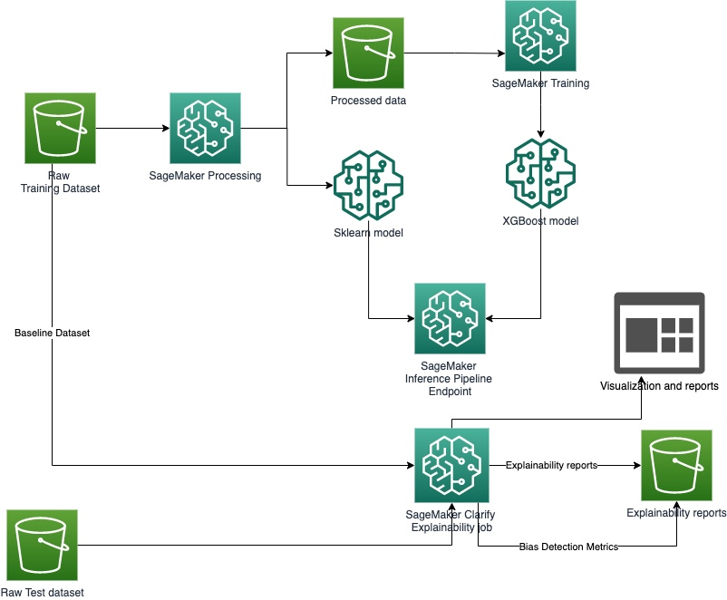
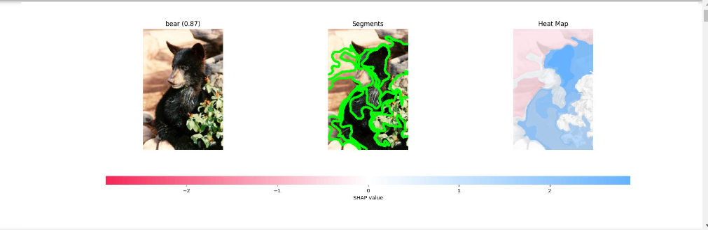
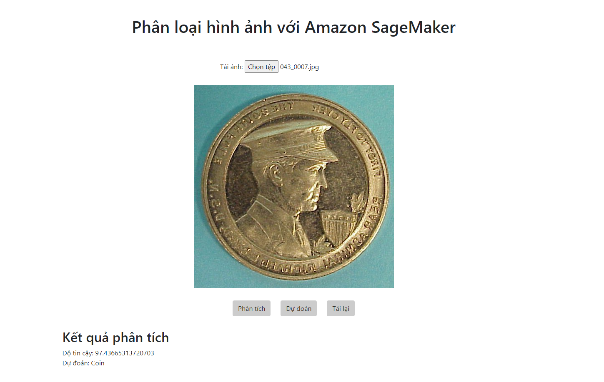

# Đề tài: Xây dựng ứng dụng dựa trên việc sử dụng Amazon-SageMarker 

# Thành viên nhóm
>
    1. Phạm Anh Tú 20110742

## 1. Diagram

## 2. Dịch vụ sử dụng
-   AWS S3:
    -   Store training data, model
-   AWS SageMaker:
    -   Training
    -   Deploy Endpoint
-   AWS EC2:
    -   Deploy streamlit webapp
## 3. Classify image

## 4. Demo app 
